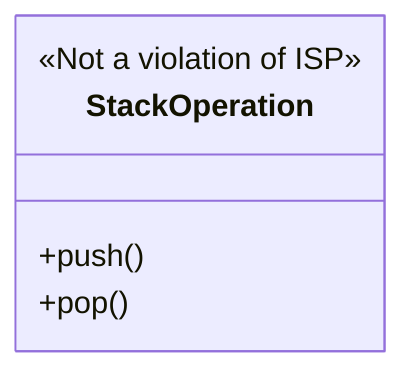

Design Principle: A set of guidelines that helps a SWE design better S/W system

S -> Single Responsibility Principle
O ->  Open-Close Principle
L -> Lisleov's Substitution Principle
I -> Interface Segregation Principle
D -> Dependency Inversion Principle

A S/W system is considered better based on the following factors:
- Maintainability
- Extensibility
- Scalability
- Modularity
- Reusability
- Readability/Understandability

# Single Responsibility Principle (SRP)

Every code unit (Class/Method/Package) should exactly have one responsibility

**One Responsibility**: There should be exactly one reason to change the code of that unit

## How to identify the violation of SRP

1. Method with multiple `if else`
	-  Not always true: If the `if else` is part of business logic, then its okay
	- Problem due to too many `if else if`
		1. Understandability
		2. Difficult to test
		3. Difficult for developers to working in parallel (Merge Conflict)
		4. Code duplication (Violets **DRY-Don't Repeat Yourself**)
		5. Less code reuse
		6. Violates SRP
2. Monster Method
	- Method that does more than its name suggest
3. Common/Utilities
	- It end up becoming a garbage place for all the code that an engineer doesn't know where to put

# Open-Closed Principle (OCP)

Code base should be open for extension but closed for modification

Code base should be extensible 
	Easy to add new feature but adding new feature shouldn't require changing written code 

Rather than modifying already written code unit add more code unit

Adding new feature in a code base should require very less, if no change, in already written code

## Why OCP
1. Regression
	- An error where a feature that worked previously stops working after code changes, system updates, or environment modifications
2. Testing

# Liskov's Substitution Principle (LSP)

Object of any child class should be as-is substitutable in the variable of the parent type, without requiring any code change

**Example:** [[Design a BIRD##Make birds fly]]

**No special treatment to any child class**

# Interface Segregation Principle (ISP)

Interface should be as light as possible (as less method as possible)

Ideally only method (not always true)

**For all the methods that are in an interface should be logically related**

**Example:**



ISP is [[#Single Responsibility Principle (SRP)|SRP]] on interface
# Dependency Inversion Principle (DIP)

No 2 concrete classes should directly depend on each other 

If they need to depend they should depend via an interface

**Example:** [[Design a BIRD##Requirement (In addition to V2 of Bird)]]

## Dependency Injection (Not part of SOLID)

```java
Pigeon extends Birds implements Flying{
	FlyBehavior fb;
	Pigeon()
	fly(){
		psfb.flyBehaviour();
	}
}
```
