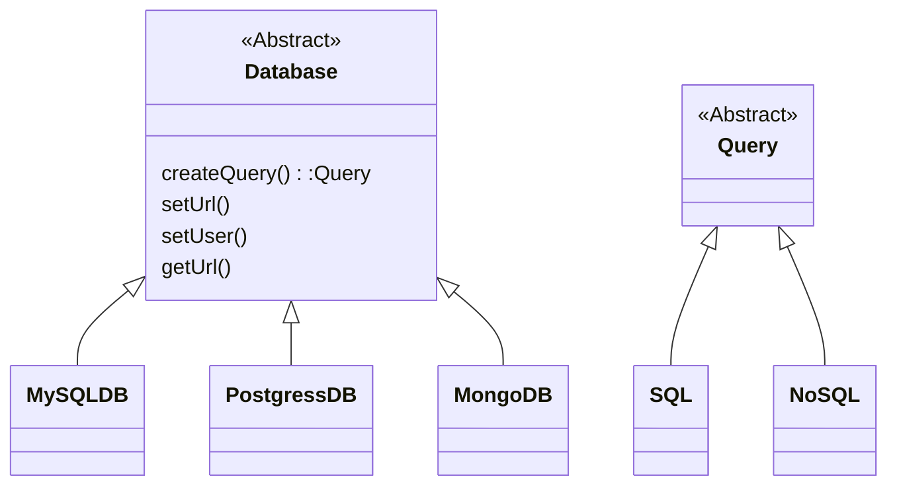
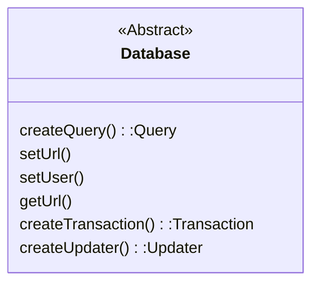
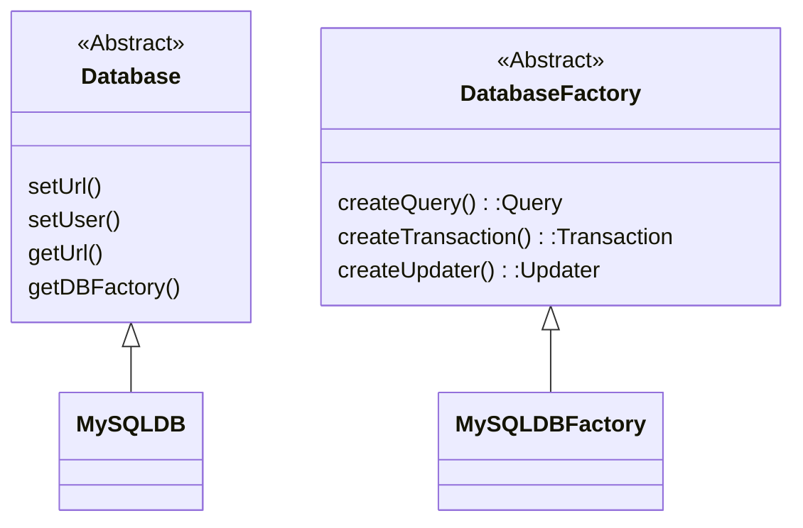
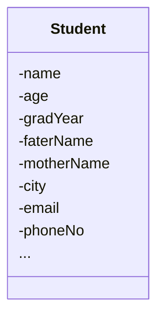
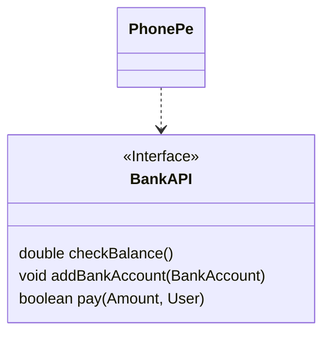
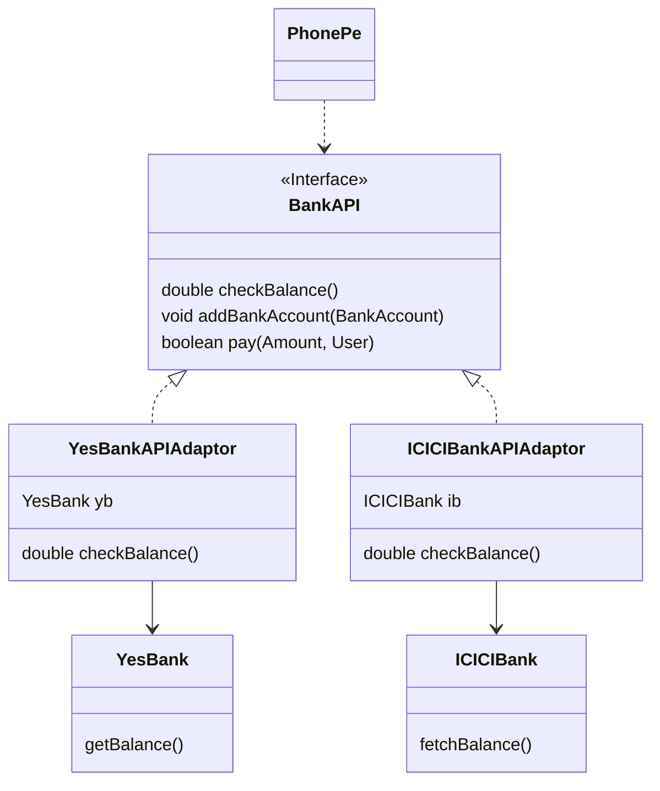
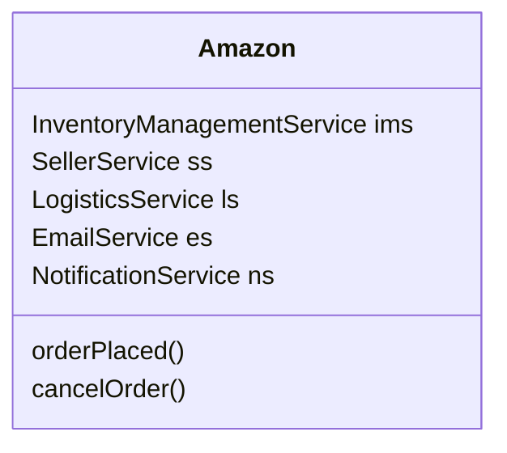
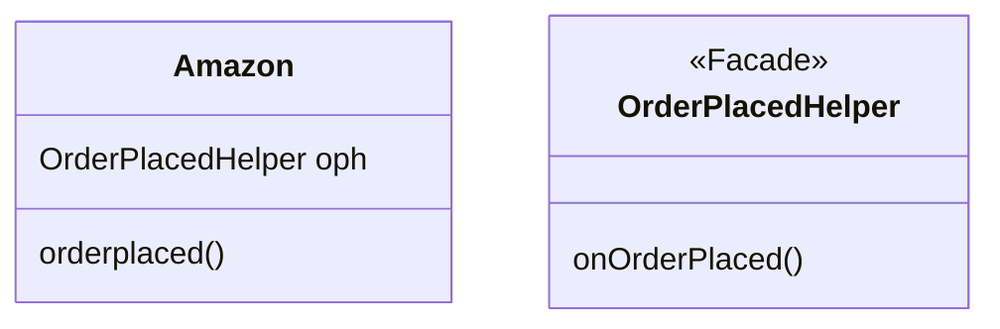

Well established solutions to common S/W problems. (in Object Oriented Design)

Design Patterns are the implementation of design principle

Why DP?
1. Saves a lot of time
2. Shared Vocabulary

# Types of Design Pattern 

1. Creational Design Pattern
	- How to create an object?
	- How many object will be created?
2. Structural Design Pattern
	- How class(es) will be structured?
	- What all attributes will be there?
	- How will a class interact with another class(es)?
3. Behavioral Design Pattern
	- How to code an action?

# Creational Design Pattern

1. Singleton DP
2. Builder DP
3. Factory DP
	- Factory method DP
	- Abstract Factory method DP
	- Practical Factory method DP

## Singleton DP
### Definition
Allows you to create a class for which only one object be created
### Why 
1. A class which is having a shared resource behind the scene
2. Creation of an object is expensive

#IMP Singletons are immutable
### How to implement

```java
class DBConn{
	String url;
	String username;
	String password;
	list<conenction> pool;
}

public class Main { 
	public static void main(String[] args) {
		DBConn db1=new DBConn(); //Instance 1
		DBConn db2=new DBConn(); //Instance 2
	}
}
```

Until the class has constructor the class is not singleton.

```java
class DBConn{
	private DBConn(){}
}
```

But now even 1 instance can't be created
#### Problem Statement
1. We need to keep constructor private
2. We need to create one object/instance
#### Solution 

```java
class DBConn{
	private static DBConn instance=null;
	private DBConn(){}
	public static DBConn createInstance(){
		if(instance==null)
			instance=new DBConn();
		return instance;
	}
}
```

1. Make constructor private
2. Create a method to create an instance
	- Method checks if it already has instance
		- YES -> return
		- NO -> create & return 

#### Solution (concurrent environment) 
Above solution won't work in concurrent (multithreading) environment

Prone to error when the object is being created for the very first time
##### **Early Loading/ Eager Execution**
```java
class DBConn{
	private static DBConn instance=new DBConn();
	private DBConn(){}
	public static DBConn getInstance(){
		return instance;
	}
}
```

Con
1. Application startup time will increase
2. Can't give variable config. 

**Happens while creation of 1st instance only**
##### **Lock**
```java
class DBConn{
	private static DBConn instance=null;
	private DBConn(){}
	public synchronized static DBConn createInstance(){
		if(instance==null)
			instance=new DBConn();
		return instance;
	}
}
```

Con 
- Every time the `createInstance()` is called lock is checked but we need to check it only for the creation of 1st instance 
- Multithreading will not be at all possible for this method
- Performance is low

##### Double-Check Locking
```java
class DBConn{
	private static DBConn instance=null;
	private DBConn(){}
	public static DBConn createInstance(){
		if(instance==null){
			LOCK;
			if(instance==null)
				instance=new DBConn();
			UNLOCK;
		}
		return instance;
	}
}
```

## Factory DP
- Factory method DP
- Abstract Factory method DP
- Practical Factory method DP

### Factory Method DP

```java
class UserService{
	Database db=new ...;
	createUser(){
		Query q=createQuery("....");
		q.execute();
	}
}
```

- If `Database` is a class, [[01. SOLID Design Principle#Dependency Inversion Principle (DIP)|DIP]] will get violated


```java
class MySQLDB{
	Query createQuery(){
		return new SQL();
	}
}
class MongoDB{
	Query createQuery(){
		return new NoSQL();
	}
}
```

**Purpose of `createQuery()` is only to return a new object of corresponding Query**

Therefore, `createQuery()` is **Factory Method**

```java
class UserService{
	Database db=new MySQLDB();
	createUser(){
		Query = db.createQuery("...");
		q.execute();
	}
}
```

### Abstract Factory



Database violates [[01. SOLID Design Principle#Single Responsibility Principle (SRP)|SRP]] by having multiple responsibilities
- Contains attribute and method needed for `Database`
- A lot of Factory Methods to get corresponding object of different types
	- `createQuery()`
	- `createTransaction()`
	- `createUpdater()`

#### Solution

Divide the class into 2 classes
1. To hold attribute and method needed
2. To hold all Factory Methods


```java
class MySQLDB{
	DBFactory getDBFactory{
		return new MySQLDBFactory();
	}
}
```

```java
class UserService{
	Database db=new MySQLDB;
	DatabaseFactory dbf=db.getDBFactory();
	Query q=dbf.createQuery();
	Tranction t=dbf.createTranction();
}
```

### Practical Factory

Create an object of the same class


```java
class DatabaseFactory{
	Database createDBbyName(String name){
		if(name=="MySQL") return new MySQLDB();
		else if(name=="MongoDB") return new MongoDB(); 
	}
}
//Database class is X class
//DatabaseFactory is XFactory
```

- `Database` class is `X` class
- `DatabaseFactory` is `XFactory`

## Builder DP

1. Create a class with a lot of attribute


```java
Student st = new Student();
st.setName("...");
st.setAge(...);
st.setGradYear(...);
...
```

2. We want to validate an object of the class before creating the object
	- No object of student should be created unless all the validations have happened
	- $\because$ object is getting created in constructor
	- $\therefore$ validations must reside there

```java
class Student{
	Student(int age,...,...,...){
		if(age<18) {
			// raise an exception;
		}
		...
		...
		...
		//Once all validation are true, initialize the object
		this.age=age;
		...
		...
		...
	}
}

public class Program{
	public static void main(arr[]){
		
	}
}
```
# Structural Design Pattern

1. Adapter DP
2. Facade DP

## Adapter DP

**Adaptor**: Intermediary layer that connects (transforms) one form to another
Example: HDMI -> USB-C

### Problem Statement
1. S/W system want to communicate with a 3rd party API
2. We might have to migrate another 3rd party API in future
### Definition
Adaptor DP ensure that our codebase remains maintainable when we're communicating to 3rd party API/Library/SDKs

1. If your codebase is directly communicating to 3rd party library, it involves a lot of tight coupling between your codebase & 3rd party software.
	- This can affect maintainability
2. Whenever you connect to a 3rd party API, never connect directly, always use an interface

### How to implement
1. Whenever you're connecting to any 3rd party API, create an interface with methods you need from the 3rd party API.


2. As 3rd party won't implement this interface for us, we should create a wrapper class that implements our interface & uses 3rd API 



```java
class YesBankAPIAdaptor{
	YesBank yb=new YesBank();
	double checkBalance(){
		return yb.getBalance();
	}
}
class ICICIBankAPIAdaptor{
	ICICIBank ib= new ICICIBank();
	double checkBalance(){
		return ib.fetchBalance();
	}
}
```
## Facade DP
### Problem Statement



```java
class Amazon{
	orderPlaced(){
		ims.update(); //Update Inventory
		ss.notify(); //Notify the Seller
		ls.createReg(); // Notify Logistics
		es.send(); //Send Email
		ns.notify(); // App Notification
	}
	cancelOrder(){
		ims.update(); //Update Inventory
		ss.notify(); //Notify the Seller
		ls.createReg(); // Notify Logistics
		es.send(); //Send Email
		ns.notify(); // App Notification
	}
}
```

- Code duplication

```
ims.update(); //Update Inventory
ss.notify(); //Notify the Seller
ls.createReg(); // Notify Logistics
es.send(); //Send Email
ns.notify(); // App Notification
```

- Currently all the work related to what will happen when an order is placed is being done by `Amazon` class itself
- This make `Amazon` class too big (linked with a lot of attributes)
### Definition 

Whenever you find a method/class that is doing too much work, outsource to a helper to do that work
### How to implement


```java
class Amazon{
	OrderPlacedHelper oph= new OrderPlacedHelper();
	orderPlaced(){
		oph.onOrderPlaced()
	}
}
class OrderPlacedHelper{
	onOrderPlaced(){
		ims.update(); //Update Inventory
		ss.notify(); //Notify the Seller
		ls.createReg(); // Notify Logistics
		es.send(); //Send Email
		ns.notify(); // App Notification
	}
}
```
