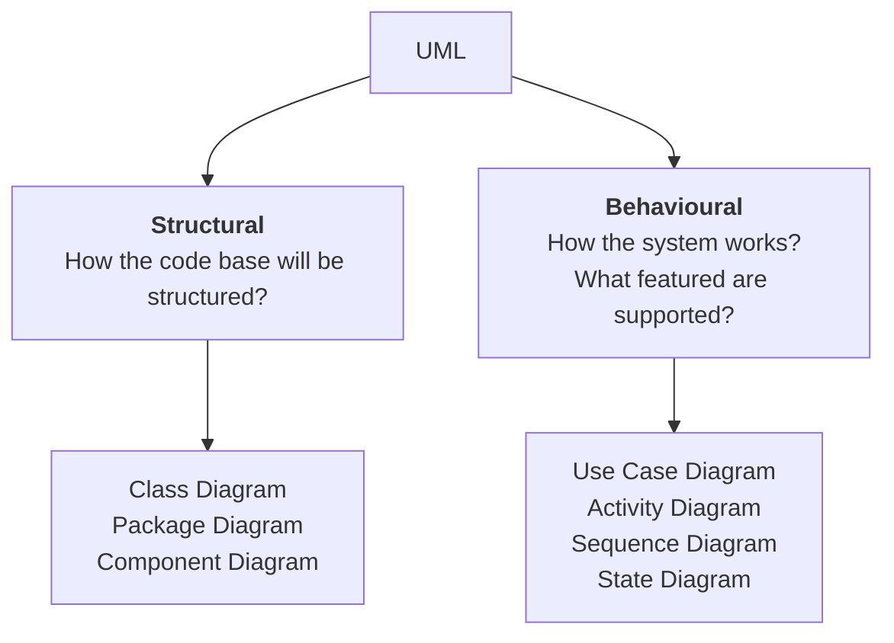
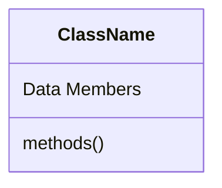
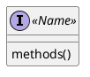
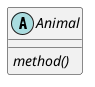
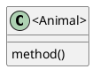
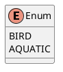

# Class Diagram

- Public : +
- Private : -
- Protected : #
- Static: <u>Underline</u>
## Interface

## Abstract: Italics

## Enumration

# Relationships
- Interface Implementation -> IS-A
- Extension -> IS-A
- Association -> HAS-A

