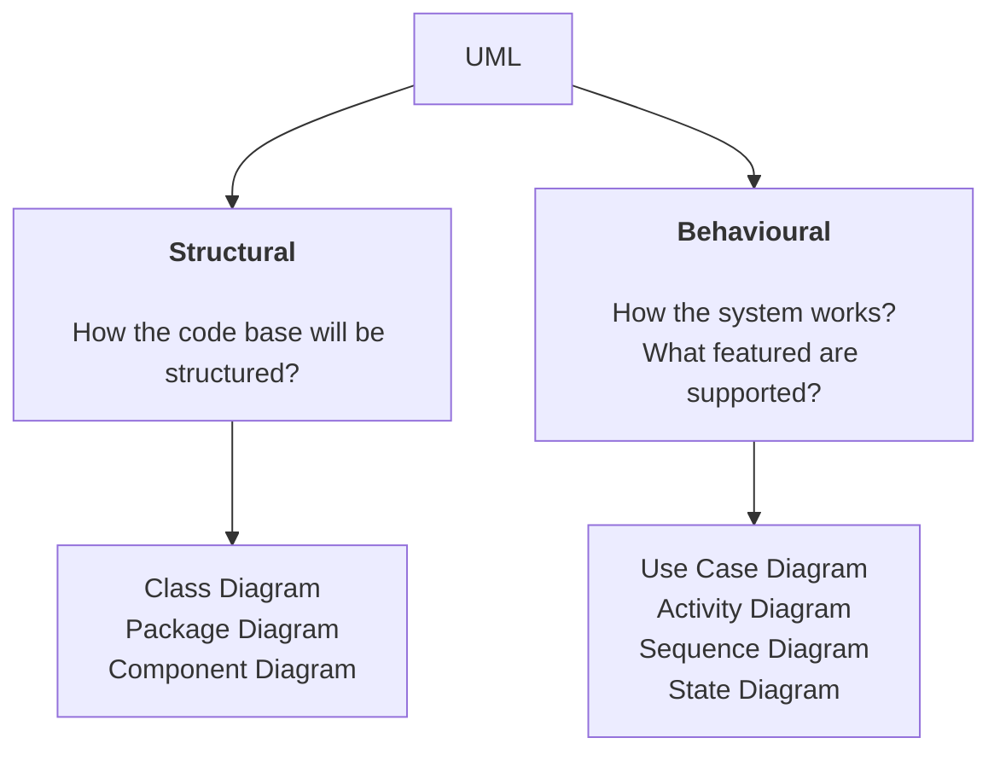
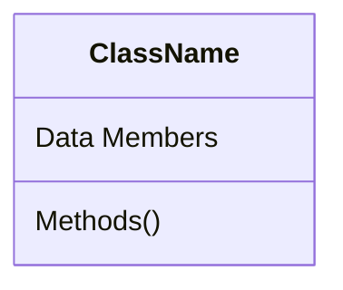
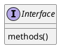

```mermaid
flowchart TD

UML --> Structural
UML --> Behavioural


Structural --> Structural_Types


Behavioural --> Behavioural_Types

Structural["<b>Structural</b><br/><br/>How the code base will be structured?"]

Structural_Types["Class Diagram<br/>Package Diagram<br/>Component Diagram"]

Behavioural["<b>Behavioural</b><br/><br/>How the system works?</br>What featured are supported?"]

Behavioural_Types["Use Case Diagram<br/>Activity Diagram<br/>Sequence Diagram<br/>State Diagram"]
```

# Class Diagram

```mermaid
classDiagram
class ClassName{
	Data Members
	Methods()
}
```

- Public : +
- Private : -
- Protected : #

## Interface

```plantuml
@startuml 
interface "Interface" 
{ 
	methods() 
} 

@enduml
```
