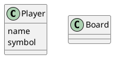

# Step 0: Overview
## Overview
## System
## No Persistence
## Interaction with Client: CLI

# Step 1: Requirement
1. A game ...
2. No. Of Player -> N
3. Size of board -> (N+1) * (N+1)
4. How a winner is decided?
	- Row
	- Column
	- Diagonals
	- Corners (Additional)
5. Each player can choose their own symbol
	- 2 players can't have same symbol
6. Who will make the first move
	- Random
	- Thereafter keep the order intact
7. Can I have a Bot?
8. Can my bots have difficulty level? -> Easy,Medium,Hard
9. Game can also end in draw when no-one can make further moves.
	- No player can leave the game in the middle
10. UNDO
	- Generally: last moves
	- Global: no need to check who pressed the button
# Step 2: Class Diagram

