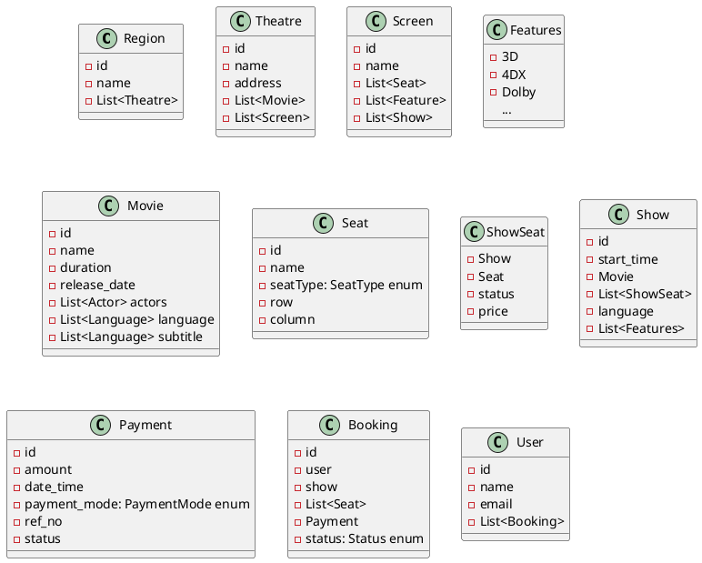

# Step 0: Overview
Movie ticket booking system
## S/W System
## Persist data -> DB is required
## Interaction with client -> CLI

# Step 1: Requirement
1. User should be able to book a movie ticket
2. Support multiple regions
3. Each Region will support multiple theatres
4. Each theatre might be running multiple different movies
5. Each theatre can have multiple screen
6. User actually book seats in a show
7. Show is a movie running in a particular theatre on a screen at a particular time
8. User should be able to book a specific type of seat
9. No two user should be allowed to book the same seat
10. At most 10 seats can be booked per booking
11. price: Seat Type + Show
12. For a movie, we need to store release-date, duration, list of actors genera 
13. Payment - III Party
	- Reference No.
	- Payment Gate way
14. Movie Feature 
	- 2D/3D/4k/Dolby
	- Language
15. User should be able to see past booking
16. User should be able to see the layout

# Step 2
## Class Diagram

