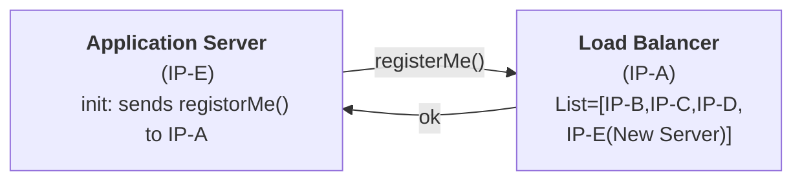

**High Level Design:** Study of how different infra layers work together to serve an application at scale at desired efficiency

# Case Study: Delicious (Website Bookmarking Application 2003)

## Webpages

## APIs 

```
createBookmark(user_id,url)
getBookmark(user_id)
```

## If we run the website on a single server.


### Website can go down because
- Overload
- Hardware failure
- Deploying a new version
## If we run the website on the multiple server


# Load Balancer

## 1. How a LB gets to know about an application server?
When an application server starts, it registers itself with LB



## 2. How LB decides which server to forward request to?
### Round Robin
### Weighted Round Robin
Distributes request in the ratio of the server configuration.
## 3. What if server dies?
**How will a LB get to know that a server has died?**
### Heartbeat
- Every server has to send a ping to LB every 't' second
- If the LB doesn't get get a ping from the server for 'nt' second, it'll assume the server is dead
n -> 3,4
### Health Check
- LB will ask server every 't' sec if they are okay
- If the server doesn't respond for 'nt' second, LB will assume that server is dead
# Sharding

Dividing the data of a DB tables into different DB machines.
## Step 1: Choose a sharding key

**Sharding key:** An attribute whose value is used as the basis for dividing data among different shards.
Elements of the same sharding key will be in the same machine
Table: Bookmarks

| id  | title | url | user_id |
| --- | ----- | --- | ------- |
| 1   | A     | a   | 1       |
| 2   | B     | b   | 1       |
| 3   | A     | a   | 2       |
| 4   | C     | a   | 2       |
| 5   | D     | d   | 1       |

**Example**:
Sharding key: Title 
	All rows with same title are on the same machine.
	`getShard(title)`-> Machine no. of the given title
### What will be good sharding key?

Table: No. of machine we need to access

| Sharding key | getBookmark(u_id) | createBookmark(u_id,url) |
| ------------ | ----------------- | ------------------------ |
| id           | All               | 1                        |
| title        | All               | 1                        |
| url          | All               | 1                        |
| user_id      | 1                 | 1                        |

Therefore, `user_id` is the best attribute to use as sharding key

## getShard() 

Properties of ideal solution:
1. Fast
2. Uniform distribution of data
3. Addition/Deletion of shard (machine) should be fast

### 1: Modulo

Shard=(sharding_key_value)%(shard_count)

Adding/Deleting a shard, a lot of data will have to move.

- [x] Fast
- [x] Uniform distribution of data
- [~] Addition/Deletion of shard (machine) should be fast
### 2: Range Based

| Sharding Key | Shard |
| ------------ | ----- |
| 0-999        | M1    |
| 1000-1999    | M2    |
| 2000-2999    | M3    |

- [x] Fast
- [~] Uniform distribution of data
- [x] Addition/Deletion of shard (machine) should be fast
### 3: Combine Both

| user_id | hash of user_id |
| ------- | --------------- |
| 1       | 44              |
| 2       | 41              |
| 3       | 47              |
| 4       | 43              |
| 5       | 46              |

| hash of user_id | Shard |
| --------------- | ----- |
| 41-43           | M1    |
| 44-46           | M2    |
| 47-49           | M3    |
- [x] Fast
- [x] Uniform distribution of data
- [x] Addition/Deletion of shard (machine) should be fast