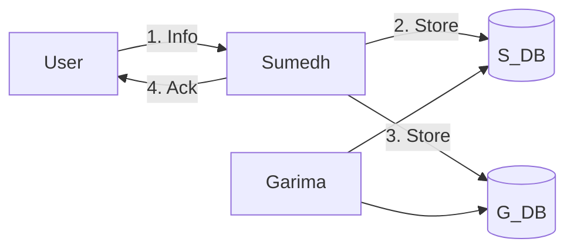
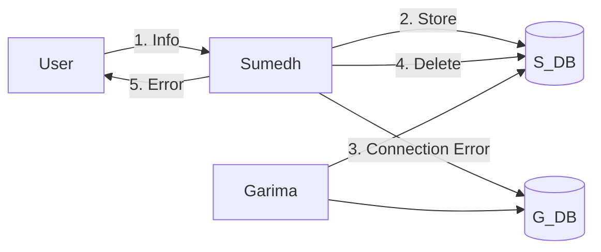
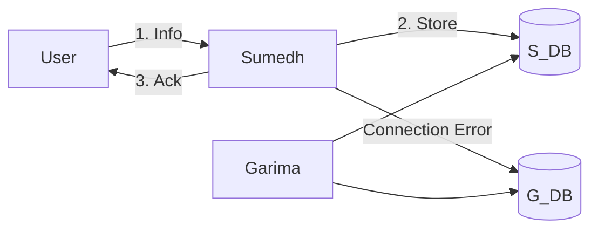

Needs to be considered even before design starts as it dictates how the design should look.

# CAP

Fundamental constraints of distributed system
- C -> Consistency
- A -> Availability
- P -> Partition Tolerance

It states, when a system has partition, the system can either be available or consistent. Never Both.

**Partition** : When software system gets divided such that there is no way to reach from there is no way to reach from one of the machine to other.
## Example
When `User` tells any info to `Sumedh`, `Sumedh` puts it in his DB(`S_DB`) as well as `G_DB` and finally confirm to customer that has noted. 

### When `Sumedh` is unable to reach `G_DB`
$\therefore$ Sumedh's system and Garima's system are now partitioned
#### Option 1
Tell the customer I am unable to do this.

- [x] Consistency
- [~] Available
#### Option 2
Store only in `S_DB` & confirm to customer

- [~] Consistency
- [x] Available
### Consistency & Availability (In reference to the example )
**Consistency**: If it return an answer will be correct BUT many times it may return nothing.

**Availability**: It will return an answer but answer may or may not be correct.
## CAP: A system can only have 2 at a time and not all three
- CA: Never have partitions (Impossible for distributed system)
- AP
- CP
# PACELC

- When system has partitions
	- P -> Partition Tolerance
	- A -> Availability
	- C -> Consistency
- When system have no partitions
	- E -> Else
	- L -> Low Latency
	- C -> Consistency

