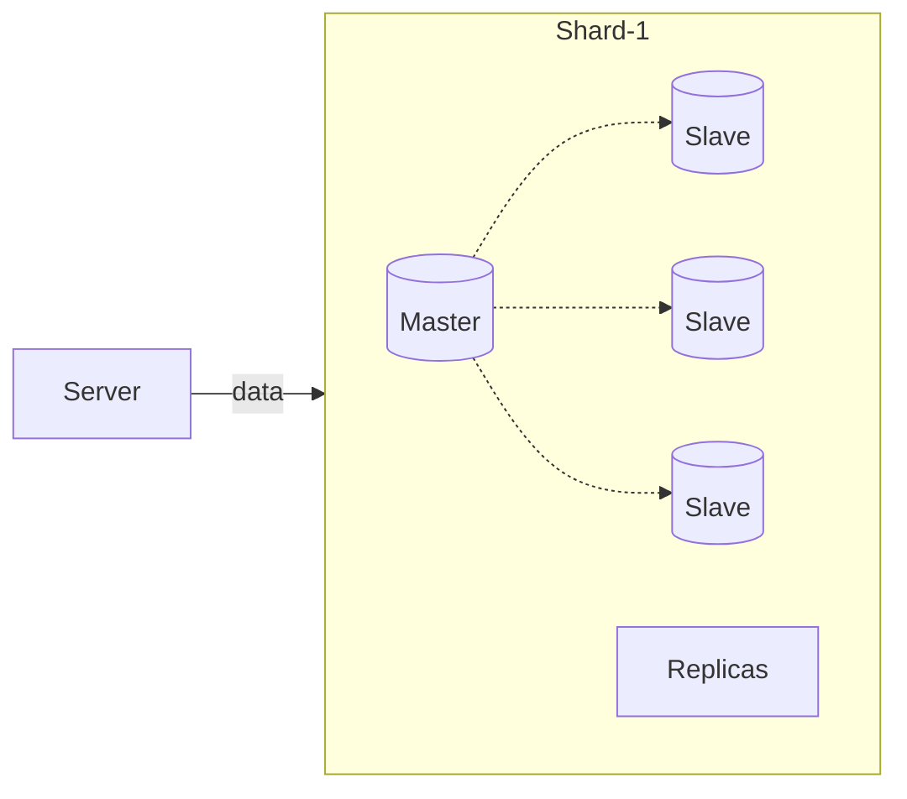
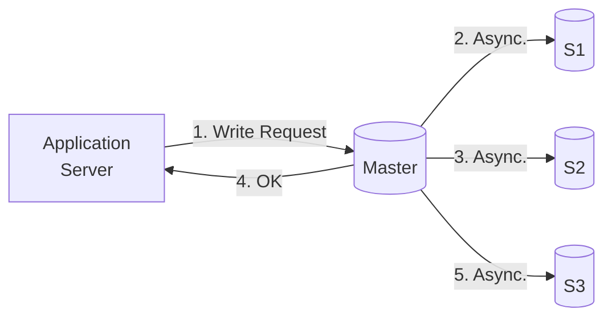

If all the data is stored in 1 machine (Assuming that it can fit)
 
 Problems
 1. Single Point Of Failure
	 If machine dies all the data is lost
2. Bottleneck
	Single machine can only handle limited number of queries

Solution
1. Backup
2. Another machine with whom the lode can be shared -> **Replica**

**Replica** 
When number of queries can't be handled by 1 machine
We will have multiple machine(Replicas) having same data

# Mater-Slave (Leader-Follower) Architecture

# Write Request

Application server should send the write request to 1 machine (Master) and that machine should distribute to others (Slaves)

**Master**: Machine that receive Write Request
	It sends the data to other (Slaves) machine

When will master write to slave?
- Consistency OR
- Availability

## 1. No Consistency

Possible that master dies before writing to one of the slaves.
- Data can be lost forever
- Not Consistence
## 2. Eventual Consistency

**Data loss is not acceptable**

