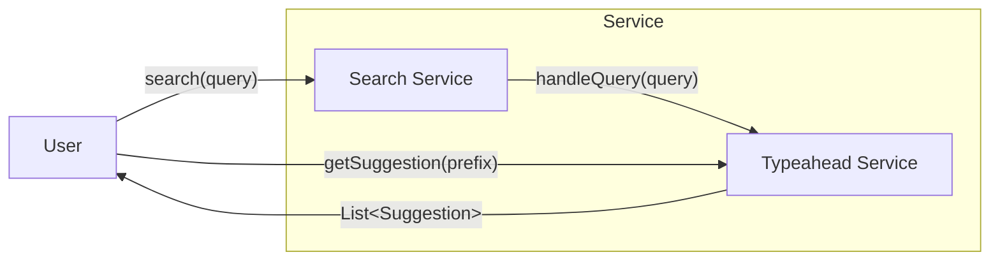
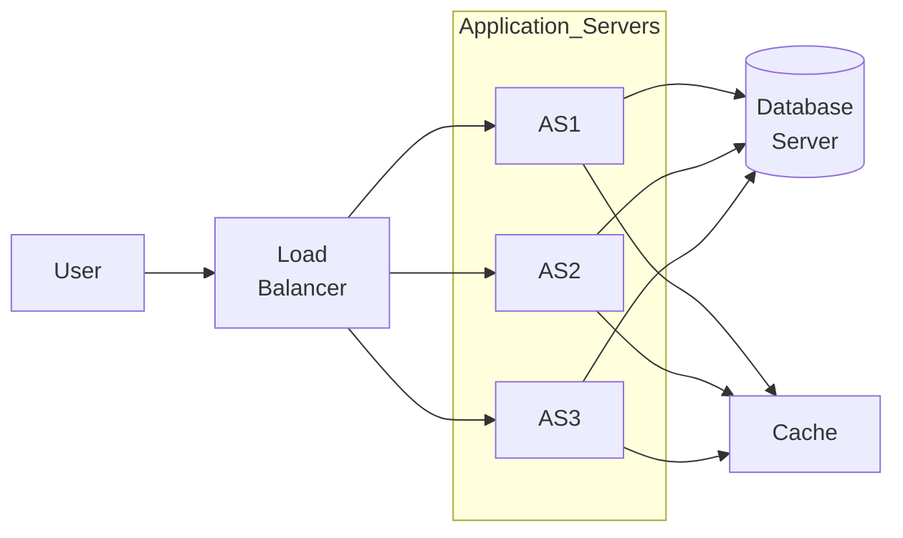
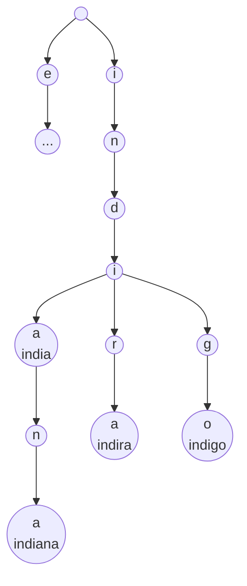

# Step 0: Overview

# Step 1: Functional Requirement
1.  System must support recommendations based on partial on partial query typed in search-box
2. No Personalized recommendation 
	- Keep it common across the globe
3. Limit: Top 5 suggestion (Based on frequency)
4. Show the suggestions after every typed character
5. Ranking 
	- Based on frequency of search
	- I should give more weightage to terms more popular recently.

# Step 2: Non Functional Requirements

## Example of Inconsistency 


But 
- Rank 1 -> B
- Rank 2 -> A
## Consistency v/s Availability

**Availability** is better user experience than Consistency
## Consistency v/s Low Latency

**Low Latency** is better user experience than Consistency
# Step 3: Estimation of Scale
## Peak RPS
Daily Active User of Google -> 1 Billion
Average # of search queries (per person per day) -> 10
\# of search queries (per day) -> 10 Billion
\# of character typed before search -> 10
\# of list(of 5) of search suggestion (per day) -> 100 Billion
\# of search suggestions (per day) -> 500 Billion

Average Request per second 
$$
\frac{500*10^9}{86400} \approx \frac{500*10^9}{10^5} = 500*10^4 =5000000\ req/sec = 5M\ req/sec
$$
**Peak Request per second** = Avg. RPS * 5 = 25 M req/sec
## Size of data

\# of search queries (per day) -> 10 Billion
% of unique search queries -> 10%
\# of unique queries (per day) -> 1 Billion
Avg. length of search queries -> 10 char 
New data stored (per day) -> 10 Billion char
New data stored (per year) -> 4000 Billion char -> $400*10^9$ char -> $400*10^9$ bytes -> 4 TB
New data stored (5 year) -> 20 TB

$\therefore$ Sharding is required

## Read Heavy or Write Heavy
\# of search suggestions (per day) -> 500 Billion (Read)
\# of unique queries (per day) -> 10 Billion (Write)

Read:Write = 50:1

# Step 4: List of APIs
1. `List<Suggestion> getSuggestions(prefix)`
2. `void handleQuery(query)`



# Step 5: Architecture



# Step 6: Deep Dive
## How will I store data such that I can handle the search suggestions?
### Approach 1: SQL Table

| term       | freq |
| ---------- | ---- |
| india      | 100  |
| election   | 200  |
| indira     | 500  |
| indigo     | 280  |
| indian     | 350  |
| indiana    | 400  |
No. of entities: Billions

Will take too much time to search through to every entity. 

### Approach 2: Trie
Assume whole data can be fit in 1 machine

Most suitable Data Structure for prefix-related queries: **Trie**

```cpp
Node{
	String term; // indi
	int count; // 5
	List<pair<string,int>> top5Searches // ["indira":500, "indiana":400, ....];
}
```


#### `List<Suggestion> getSuggestions(prefix)`
Return the `top5Search` where the `term` is prefix.
#### `void handleQuery(query)`
- Update the `count` value for the TrieNode of that `term`.
- While returning (from Recursion) for all ancestors of above node, 
	- If the `query` is in `top5Search`, update it's `count`
	- Else if the new count is higher than any of the `top5Search` then replace the one with least freq.

But it won't work for distributed system, there is no distributed Trie.
### Approach 3: Key-Value DB

```
Map<String,int> count
Map<Sring,List<pair<String,int>>> top5Search
```

```cpp
List<Suggestion> getSuggestions(prefix){
	return suggestions[prefix];
}
void handleQuery(query){
	count[query]+=1;
	for every prefix of query
		- If the `query` is in top5Search, update it's count
		- Else if the new count is higher than any of the top5Search then replace the one with least freq.
}
```
### Sharding key
Sharding key will definitely will be term/prefix but how exactly.
#### Only 1st char

```
a
b
c
.
.
.
z
```

No. of shards: 26
Problems
- Limit # of shards
- No uniform distribution
#### 3 characters
No. of shards: $26^3$
Better than only 1 char
## How to handle recency ?
**Example**
![[Typeahead No Recency.svg]]


## How to handle huge # of reads & write?

Can we reduce Read Queries? -> No

Can we reduce Write Queries? 
We don't need exact count of frequencies, we just need relative amount of frequencies

$\therefore$ We can sample out some of the `void handleQuery(query)` to reduce Write Queries

Note: 
- Google sample 90% of the Write Queries
- So, only 10% of the request goes through to update DB


