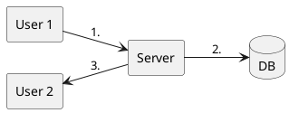
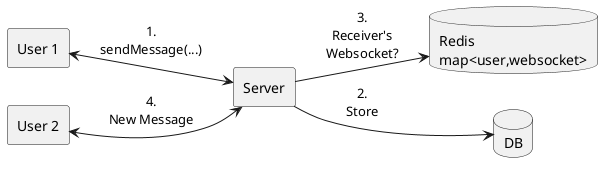

# Step 0: Overview
# Step 1: Functional Requirement
1. Send & Receive message
2. 1 on 1 chatting (No groups)
3. Only text message
4. Messages are stored in Backend
5. Get recent conversations

# Step 2: Non Functional Requirements
## Consistency v/s Availability
### Consistency in context
- Send a failure if the message is not send to receiver
- Order of message should be same for sender and receiver
### $\therefore$ Consistency ✓

## Consistency v/s Low Latency

### Consistency ✓

# Step 3: Estimation of Scale
## Peak RPS
Daily Active Users: 500 Million
Avg. messages/user/day: 20
\# messages/day=10 Billion

Avg. RPS= $\frac{10*10^9}{10^5} = 10^5\ \frac{messages}{sec}$
Peak RPS= Avg. RPS * 5 = $5*10^5$ messages/sec
## Size of data
\# messages/day=10 Billion
data/messages=100 bytes
```
message{
	id -> 8 bytes
	timestamp -> 8 bytes
	senderid -> 8 bytes
	receiverid -> 8 bytes
	content -> 50 bytes(Avg. 50 char)
}
```

data/day= 10 B * 100 bytes =  $10^{18}$ bytes = 1 TB
data/year = 400 TB
data in 5 year = 2000 TB = 2 PB
## Read Heavy or Write Heavy

Read:Write = 1:1
# Step 4: API Design
- `getRecentConversation(user_id)`
- `getMessages(conversation_id,timestamp,count)`
- `sendMessages(convesation_id,user_id,contact)`
- `createConversation(user_id,user_id)`

# Step 5: High Level Design


Problems
- Server can't initiate a message to a user, user has to initiate a conversation. (In modern Client-Server system)
- $\therefore$ Step 3. is not possible

## How server will send message to receiver?

### Polling
The client sends requests to the server at regular intervals, checking if anything has changed.

**Working**
1. Client sends an HTTP request to the server
2. Server responds immediately with current data (or empty response)
3. Client waits for a fixed interval (e.g., 5 seconds)
4. Client sends another request
5. Repeat indefinitely


**Cons**
- Wastage of resources
- Message aren't Real Time

### Long Polling
- In long polling, **the client sends a request to the server, and the server holds onto the request, waiting for updates or new data**.
- It doesn't respond immediately if there is no new information available. **The server responds as soon as there is new data to send or after a certain timeout period,** and then the **client immediately sends another request**, creating a cycle of long-polling requests to maintain real-time communication.
**Working** 
1. Client sends an HTTP request to the server
2. Server holds the connection open (doesn’t respond immediately)
3. When new data arrives, server sends the response
4. Client immediately sends another request
5. If no data arrives within the timeout period, server sends an empty response and client reconnects


**Pros**
- Client resources are not unused
**Cons**
- A lot of connection request from client & server during a high freq. conversation
- High RAM usage at server to maintain connection

### WebSocket
WebSocket is a real-time technology that enables bidirectional, full-duplex communication between client and server over a persistent, single-socket connection.
 The WebSocket connection is kept alive for as long as needed, allowing the server and the client to send data at will, with minimal overhead.
 
 **Pros**
 - Create connection only once
 **Cons**
 - High RAM usage

## New HLD

# Step 6: Deep Dive
## Idempotency
How to ensure each message is only delivered once?
↓
How should we handle duplicate request for `sendMessage(...)` ?
↓
How to recognize duplicate request?

Unique Identifier
- [~] timestamp
	- 2 users can send message at the same time
- [~] timestamp+user_id
	- Same user can send 2 message at same time from different devices
- [x] **timestamp+user_id+device**

## How to shard data?
Potential sharding key:
- `user_id`
- `conv_id`

**`conv_id`** 
	All the messages of same conversation in same DB
	APIs
	-  `getMessages(conv_id)`: 1
	- `sendMessage(conv_id)`: 1
	- `getRecentCoversation(user_id)`: All

`user_id`
	All message receive or sent by user in same shard
	APIs
	-  `getMessages(conv_id)`: 1
	- `sendMessage(conv_id)`: 2
	- `getRecentCoversation(user_id)`: 1

### For Group Chat (Optimized conv_id)
**`conv_id`** 
	APIs
	-  `getMessages(conv_id)`: 1
	- `sendMessage(conv_id)`: 1
	- `getRecentCoversation(user_id)`: All

`user_id`
	APIs
	-  `getMessages(conv_id)`: 1
	- `sendMessage(conv_id)`: ALL
	- `getRecentCoversation(user_id)`: 1

Better solution: **Optimized conv_id**
Shard by `conv_id` 
+
Create another table called `recent_conversation` sharded by `user_id`

| user_id | recent_user | last_message |
| ------- | ----------- | ------------ |
| ABC     | XYZ         | ...          |

-  `getMessages(conv_id)`: 1
- `sendMessage(conv_id)`: 1(`messages` table) + ALL (`recent_conversation` table)
- `getRecentCoversation(user_id)`: 1

ALL (`recent_conversation` table) < ALL (`messages` table)
## How to maintain consistency of message?

Avoid situation where
- A sends a message to B
- A see that message is delivered
- B doesn't see message

## Solution 1
