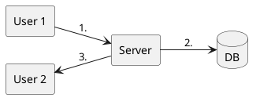

# Step 0: Overview
# Step 1: Functional Requirement
1. Send & Receive message
2. 1 on 1 chatting (No groups)
3. Only text message
4. Messages are stored in Backend
5. Get recent conversations

# Step 2: Non Functional Requirements
## Consistency v/s Availability
### Consistency in context
- Send a failure if the message is not send to receiver
- Order of message should be same for sender and receiver
### $\therefore$ Consistency ✓

## Consistency v/s Low Latency

### Consistency ✓

# Step 3: Estimation of Scale
## Peak RPS
Daily Active Users: 500 Million
Avg. messages/user/day: 20
\# messages/day=10 Billion

Avg. RPS= $\frac{10*10^9}{10^5} = 10^5\ \frac{messages}{sec}$
Peak RPS= Avg. RPS * 5 = $5*10^5$ messages/sec
## Size of data
\# messages/day=10 Billion
data/messages=100 bytes
```
message{
	id -> 8 bytes
	timestamp -> 8 bytes
	senderid -> 8 bytes
	receiverid -> 8 bytes
	content -> 50 bytes(Avg. 50 char)
}
```

data/day= 10 B * 100 bytes =  $10^{18}$ bytes = 1 TB
data/year = 400 TB
data in 5 year = 2000 TB = 2 PB
## Read Heavy or Write Heavy

Read:Write = 1:1
# Step 4: API Design
- `getRecentConversation(user_id)`
- `getMessages(conversation_id,timestamp,count)`
- `sendMessages(convesation_id,user_id,contact)`
- `createConversation(user_id,user_id)`

# Step 5: High Level Design


Problems
- Server can't initiate a message to a user, user has to initiate a conversation. (In modern Client-Server system)
- $\therefore$ Step 3. is not possible

## How server will send message to receiver?

### Polling
Cons
- Wastage of resources
- Message aren't Real Time

### Long Polling
Pros
- Client resources are not unused
Cons
- A lot of connection request from client & server during a high freq. conversation
- High RAM usage at server to maintain connection

### WebSocket