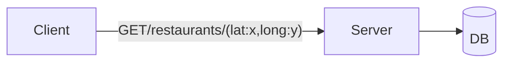

**Finding Restaurants near a given location**

# APIs
`List<Restaurants> findNearbyRestaurants(location)`

We want 100 nearest restaurant
# Approach 1: Brute Force
**Table: Restaurants**

| id  | name | ... | location(lat,long) |
| --- | ---- | --- | ------------------ |
|     |      |     |                    |


```
heap=[]
for every restaurant(Rx,Ry)
	dis=√((Rx-x)²+(Ry-y)²)
	heap.put(dis,res)
	if(heap.size()>100)
		heap.pop()
```

## Approach 1.1: Decrease search size
Instead of searching complete earth find restaurants within a smaller area

```SQL
SELECT *
FROM Restaurants
WHERE lat>x-dx && lat < x+dx AND long>y-dy &&long<y+dy
```

If Output<100 Restaurant->Increase `dx` and `dy`->Repeat
Else->Return


# Approach 2: Divide the world into area such that each area has $\approx$ 100 restaurants 

## Approach 2.1: Divide the World into fixed size rectangle


| id  | name | ... | row_id | col_id |
| --- | ---- | --- | ------ | ------ |
|     |      |     |        |        |
```SQL
SELECT *
FROM Rectangle
WHERE row_id==x && col_id==y
```

If Output<100
```SQL
SELECT *
FROM Rectangle
WHERE row_id>x-1 && row_id<x+1 AND col_id>y-1 && col_id<y+1
```

And so on....

$\therefore$ 
```SQL
SELECT *
FROM Rectangle
WHERE row_id=>x-dx && row_id<=x+dx AND col_id=>y-dx && col_id<=y+dx
```

Initial `dx` = 0 
`dy` = 0
If Output<100 Restaurant->Increase `dx` and `dy`->Repeat
Else->Return

**Cons**
Each area is not guaranteed to have approx. 100 restaurant  
$\therefore$ The efficiency of the request will vary as per where the person is located

## Approach2.2: Divide the world in variable size rectangle
**Each Rectangle have approx. 100 restaurant**


### Quad-Trees
A quad tree is a tree with four child nodes.

A quadtree is a data structure that is commonly used to partition a two-dimensional space by recursively subdividing it into four quadrants (grids) until the contents of the grids meet certain criteria.

Areas with many objects get split into smaller and smaller regions, while empty areas stay as larger chunks, saving resources by focusing detail only where needed.


### Example 
Threshold No.: 5
We will split any node into quadrant if it has more than 5 restaurant.


### How to identify a rectangle?
- 2 diagonally opposite vertex ($x_{1},y_{1}$) & ($x_{2},y_{2}$)
- Center and 1 vertex ($x_{c},y_{c}$) & ($x_{1},y_{1}$)
### Tree Structure

### Node
```java
class Node{
    Point topLeft;
    Point bottomRight;
    
    Node topLeftChild;
    Node topRightChild;
    Node bottomLeftChild;
    Node bottomRightChild;
    
    boolean isLeaf = true;
    List<Point> points = new ArrayList<>();
}
```
We can represent a rectangle by using two points:

1. The top left point
2. The bottom right point

Using these two you can draw the entire rectangle.

So we will use the latitude,longitude pair at the top left and bottom right to represent a node in Quad tree.

Each node can have four childs:

The top left , top right , bottom left and bottom right.

```
    Node topLeftChild;    Node topRightChild;    Node bottomLeftChild;    Node bottomRightChild;
```

And only the leaf nodes have values , so we use a flag to identify if it is a leaf node or not:

```
boolean isLeaf = true;
```

Finally we have all the cafe locations within that node:

```
List<Point> points = new ArrayList<>();
```

Remember that only leaf nodes will have value for the above field.

Also the total number of points can be maximum up to the number of cafes you want to configure within a node.

### Algorithm to find leaf node for a point:

```java
while (!node.isLeaf) { node = findNodeForPoint(node, point); }
```

```java
private Node findNodeForPoint(Node node, Point point) {
    float latitude = point.latitude;
    float longitude = point.longitude;

    Point topLeft = node.topLeft;
    Point bottomRight = node.bottomRight;

    Point centre = new Point(
        (topLeft.latitude + bottomRight.latitude) / 2,
        (topLeft.longitude + bottomRight.longitude) / 2
    );

    // Check if top left node
    if (longitude >= topLeft.longitude
            && longitude <= centre.longitude
            && latitude <= topLeft.latitude
            && latitude >= centre.latitude) {
        return node.topLeftChild;
    }

    // Check if top right node
    if (longitude > centre.longitude
            && longitude <= bottomRight.longitude
            && latitude <= topLeft.latitude
            && latitude >= centre.latitude) {
        return node.topRightChild;
    }

    // Check if bottom left node
    if (longitude >= topLeft.longitude
            && longitude <= centre.longitude
            && latitude > centre.latitude
            && latitude <= bottomRight.latitude) {
        return node.bottomLeftChild;
    }

    // Check if bottom right node
    return node.bottomRightChild;
}
```

### Search Algorithm to find out all the cafes nearby to a client
Algorithm:
1. Find out the node which includes the client's location
2. Return all the points in that node

```java
public void search(Point point,Node node=root) {
    while (!node.isLeaf) {
        node = findNodeForPoint(node, point);
    }

    System.out.print(node.points);
}
```

The number of restaurants returned in the above search query can be less than 5. This is because the parent node contained more than 5 nodes and so we subdivided it.

To return at least 5 restaurants to the client we can include the restaurants in other child nodes of the same parent which we have not covered above.

```java
public void search(Point point,Node node=root) {

        Node parent = null ;

        while (!node.isLeaf) {
            //find the parent node
            parent = node;
            node = findNodeForPoint(node, point);

        }

        if(node.points.size() < 5 ){

            List<Point> tlpoints = parent.topLeftChild.points;
            List<Point> trpoints = parent.topRightChild.points;
            List<Point> blpoints = parent.bottomLeftChild.points;
            List<Point> brpoints = parent.bottomRightChild.points;

            System.out.println(tlpoints);
            System.out.println(trpoints);
            System.out.println(blpoints);
            System.out.println(brpoints);

        }else {

            System.out.print(node.points);
        }
    }
```

The above code will print out all the nodes under the common parent and you can further choose which one among them you want to return to the client.


