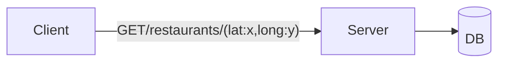

**Finding Restaurants near a given location**

# APIs
`List<Restaurants> findNearbyRestaurants(location)`

We want 100 nearest restaurant
# Approach 1: Brute Force
**Table: Restaurants**

| id  | name | ... | location(lat,long) |
| --- | ---- | --- | ------------------ |
|     |      |     |                    |


```
heap=[]
for every restaurant(Rx,Ry)
	dis=√((Rx-x)²+(Ry-y)²)
	heap.put(dis,res)
	if(heap.size()>100)
		heap.pop()
```

## Approach 1.1: Decrease search size
Instead of searching complete earth find restaurants within a smaller area

```SQL
SELECT *
FROM Restaurants
WHERE lat>x-dx && lat < x+dx AND long>y-dy &&long<y+dy
```

If Output<100 Restaurant->Increase `dx` and `dy`->Repeat
Else->Return


# Approach 2: Divide the world into area such that each area has $\approx$ 100 restaurants 

## Approach 2.1: Divide the World into fixed size rectangle


| id  | name | ... | row_id | col_id |
| --- | ---- | --- | ------ | ------ |
|     |      |     |        |        |
```SQL
SELECT *
FROM Rectangle
WHERE row_id==x && col_id==y
```

If Output<100
```SQL
SELECT *
FROM Rectangle
WHERE row_id>x-1 && row_id<x+1 AND col_id>y-1 && col_id<y+1
```

And so on....

$\therefore$ 
```SQL
SELECT *
FROM Rectangle
WHERE row_id=>x-dx && row_id<=x+dx AND col_id=>y-dx && col_id<=y+dx
```

Initial `dx` = 0 
`dy` = 0
If Output<100 Restaurant->Increase `dx` and `dy`->Repeat
Else->Return

**Cons**
Each area is not guaranteed to have approx. 100 restaurant  
$\therefore$ The efficiency of the request will vary as per where the person is located

## Approach2.2: Divide the world in variable size rectangle
**Each Rectangle have approx. 100 restaurant**


### Quad-Trees
A quad tree is a tree with four child nodes.

A quadtree is a data structure that is commonly used to partition a two-dimensional space by recursively subdividing it into four quadrants (grids) until the contents of the grids meet certain criteria.

Areas with many objects get split into smaller and smaller regions, while empty areas stay as larger chunks, saving resources by focusing detail only where needed.


### Example 
Threshold No.: 5
We will split any node into quadrant if it has more than 5 restaurant.

### How to identify a rectangle?
- 2 diagonally opposite vertex ($x_{1},y_{1}$) & ($x_{2},y_{2}$)
- Center and 1 vertex ($x_{c},y_{c}$) & ($x_{1},y_{1}$)