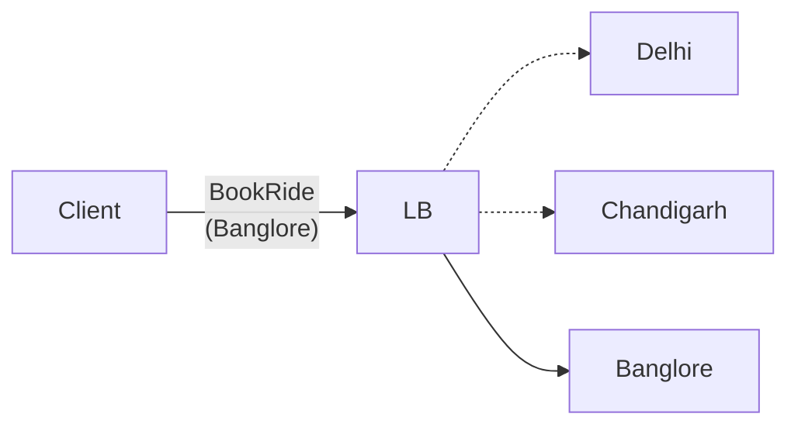

Difference from the restaurant location:
1. No. of cabs >>> No. of restaurant
2. Cabs moves unlike restaurants

# 1: Shard the Quad Tree
Sharding Key: City
This solves our problem no. 1.  No. of cabs >>> No. of restaurant

# 2: Handle Location Update

## Approach 1: Brute Force
On every location update -> Add and Delete nodes from Quad Tree accordingly -> Very inefficient -> Slow system

## Approach 2: 
On every location update -> We update the location of cabs in relevant nodes without updating the structure of Quad Tree

#### When to update the Quad Tree structure

