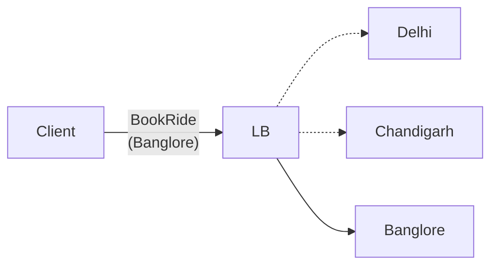

Difference from the restaurant location:
1. No. of cabs >>> No. of restaurant
2. Cabs moves unlike restaurants

# 1: Shard the Quad Tree
Sharding Key: City
This solves our problem no. 1.  No. of cabs >>> No. of restaurant

# 2: Handle Location Update

## Approach 1: Brute Force
On every location update -> Add and Delete nodes from Quad Tree accordingly -> Very inefficient -> Slow system

## Approach 2: 
On every location update -> We update the location of cabs in relevant nodes without updating the structure of Quad Tree
#### When to update the Quad Tree structure

Update the structure of Quad Tree at midnight (Off-Peak time) based on the location of cabs at peak time yesterday.

## `updateLocation(newLocation)`

1. Get previous location of cab -> O(1)
2. Go to node containing the previous location -> O(logN)
3. Remove cab from that node -> O(1)
4. Get the leaf node containing new location -> O(logN)
5. Add the cab to that node -> O(1)
6. Update location in memory of cache -> O(1)

## Time Complexity 

Assume 10 Lakh cabs update their location every 10 sec
$10^6$ operation every 10 sec of O(logN)
$10^5$ operation every sec -> N=$10^5$
Time Complexity -> O(NlogN) 