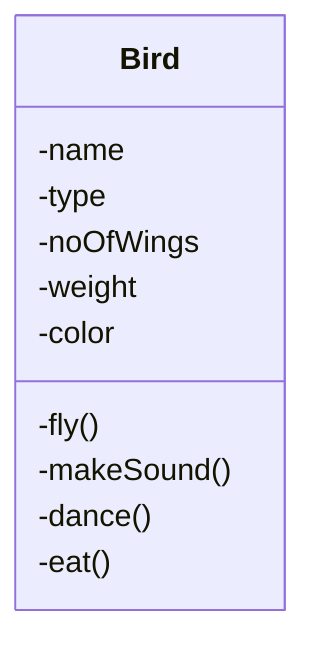

Build a S/W system where you can store information about birds.

Information
-  Properties
-  Behavior
# Version 0 (Brute Force)



```python
makeSound(){
	if type==crow
		cout<<"kaw kaw"
	elif type==sparrow
		cout<<"chaw chaw"
	elif type==pigeon
		cout<<"yaw yaw"
}
```

