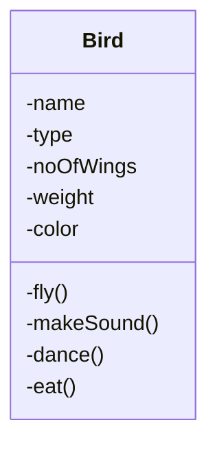
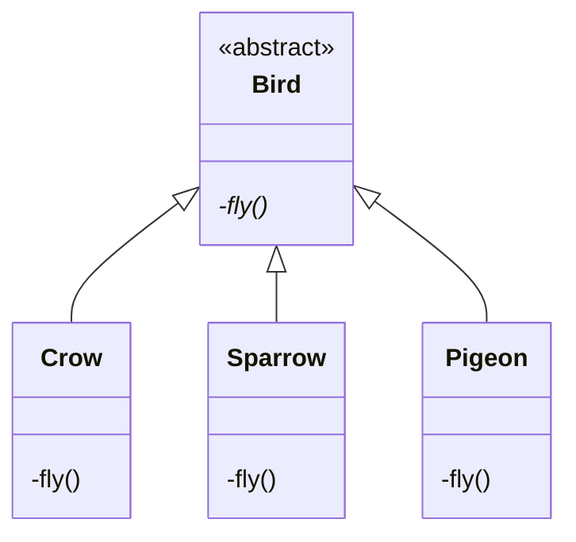
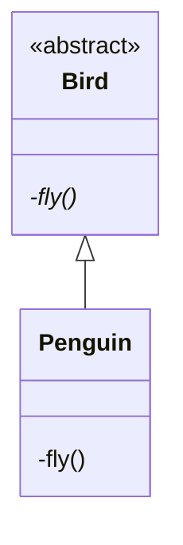
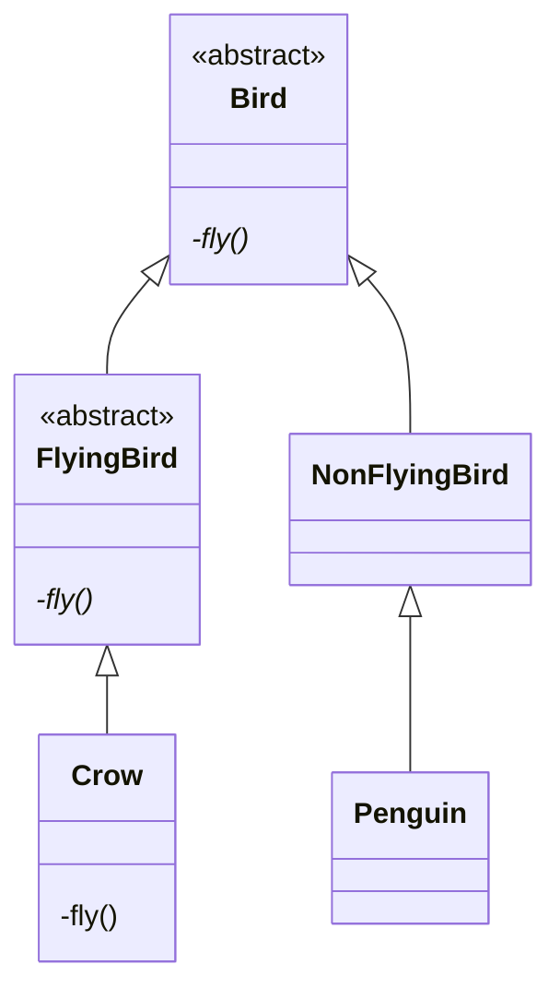

Build a S/W system where you can store information about birds.

Information
-  Properties
-  Behavior
# Version 0 (Brute Force)



```python
makeSound(){
	if type==crow
		cout<<"kaw kaw"
	elif type==sparrow
		cout<<"chaw chaw"
	elif type==pigeon
		cout<<"yaw yaw"
}
```

# Version 1

Let the `Bird` class be only responsible for generic details and not specific



- To add a new bird, I just have to create a new bird class
- Bird class have less reason to change
- Bird is abstract class

## Requirement: Birds which can't fly (Penguin)

### Solution 1 (Wrong)


Ways to implement this
1. Empty method
2. print "Penguin can't fly."
3. throw exception

### Solution 2 (Ideal)

If an entity doesn't support a behavior, it should not have a method to do the behavior.


