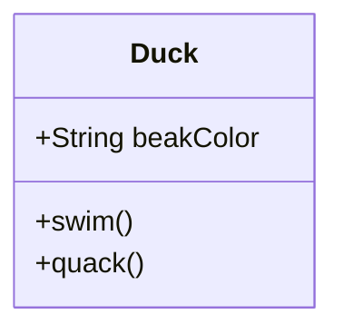

Build a S/W system where you can store information about birds.

Information
	-  Properties
	-  Behavior

```mermaid
classDiagram 
class Duck{
            +String beakColor
            +swim()
            +quack()
        }

```

