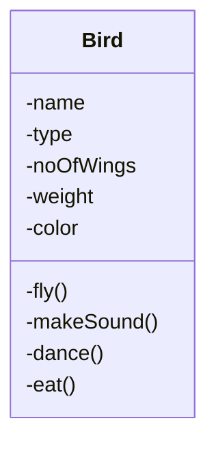
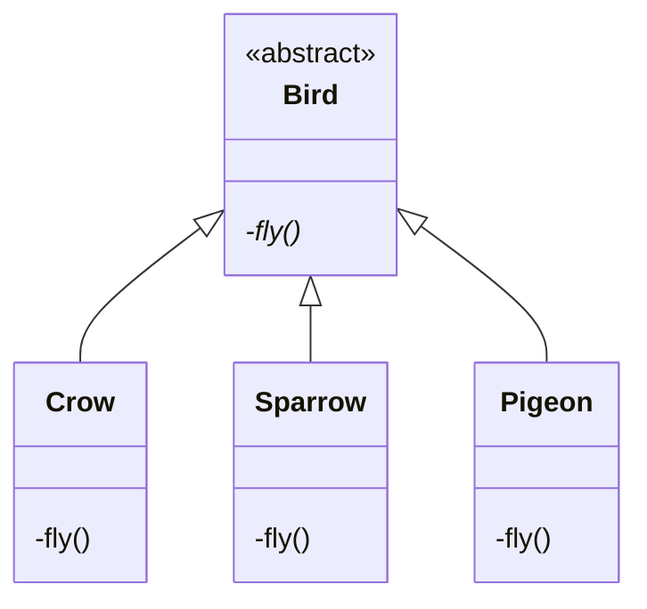
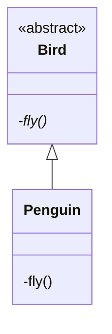
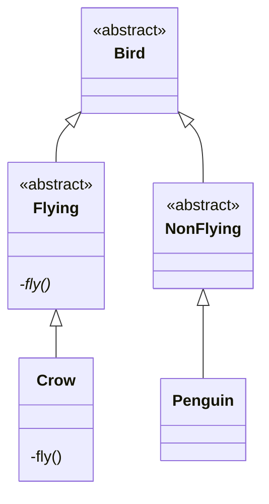
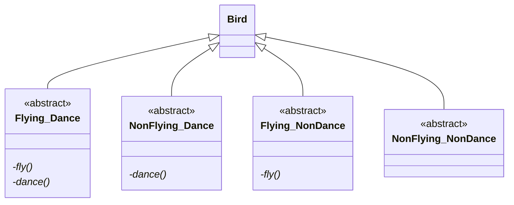
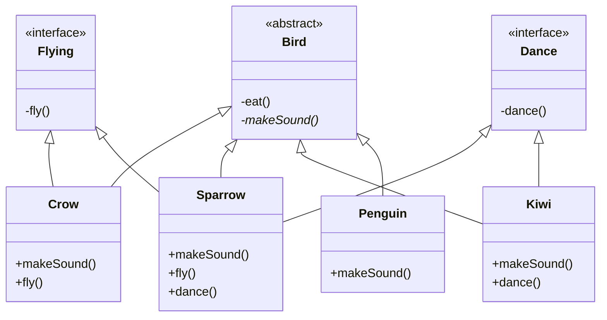

Build a S/W system where you can store information about birds.

Information
-  Properties
-  Behavior
# Version 0 (Brute Force)



```python
makeSound(){
	if type==crow
		cout<<"kaw kaw"
	elif type==sparrow
		cout<<"chaw chaw"
	elif type==pigeon
		cout<<"yaw yaw"
}
```

# Version 1

Let the `Bird` class be only responsible for generic details and not specific



- To add a new bird, I just have to create a new bird class
- Bird class have less reason to change
- Bird is abstract class

## Requirement: Birds which can't fly (Penguin)

### Solution 1 (Wrong)


Ways to implement this
1. Empty method
2. print "Penguin can't fly."
3. throw exception

### Solution 2 (Ideal): Version 1.5

If an entity doesn't support a behavior, it should not have a method to do the behavior.


## Requirement: Bird which can't fly+dance


### Problems
- Class Explosion (Too many class)
- How to get list of all the flying bird?
# Version 2

## Problem

Some bird demonstrate a behavior while other birds don't demonstrate that behavior 
1. Only the birds having that behavior should have that method
2. Should be able to create a list of bird that have a particular behavior



```python
class Sparrow extends Bird implement Flying,Dance{
	makeSound(){
		......
	}
	fly(){
		......
	}
	dance(){
		......
	}
}
```

## Make birds fly

### Version 1
```python
List<Bird> birds;
for(Bird b:birds){
	try{
		b.fly(); #Runtime exception if b is Penguin
	}catch(){
	}
}
```

**Violates [[01. SOLID Design Principle#Liskov's Substitution Principle|LSP]]**
### Version 2
```python
List<Flying> birds;
for(Flying b:birds){
	b.fly();
}
```

